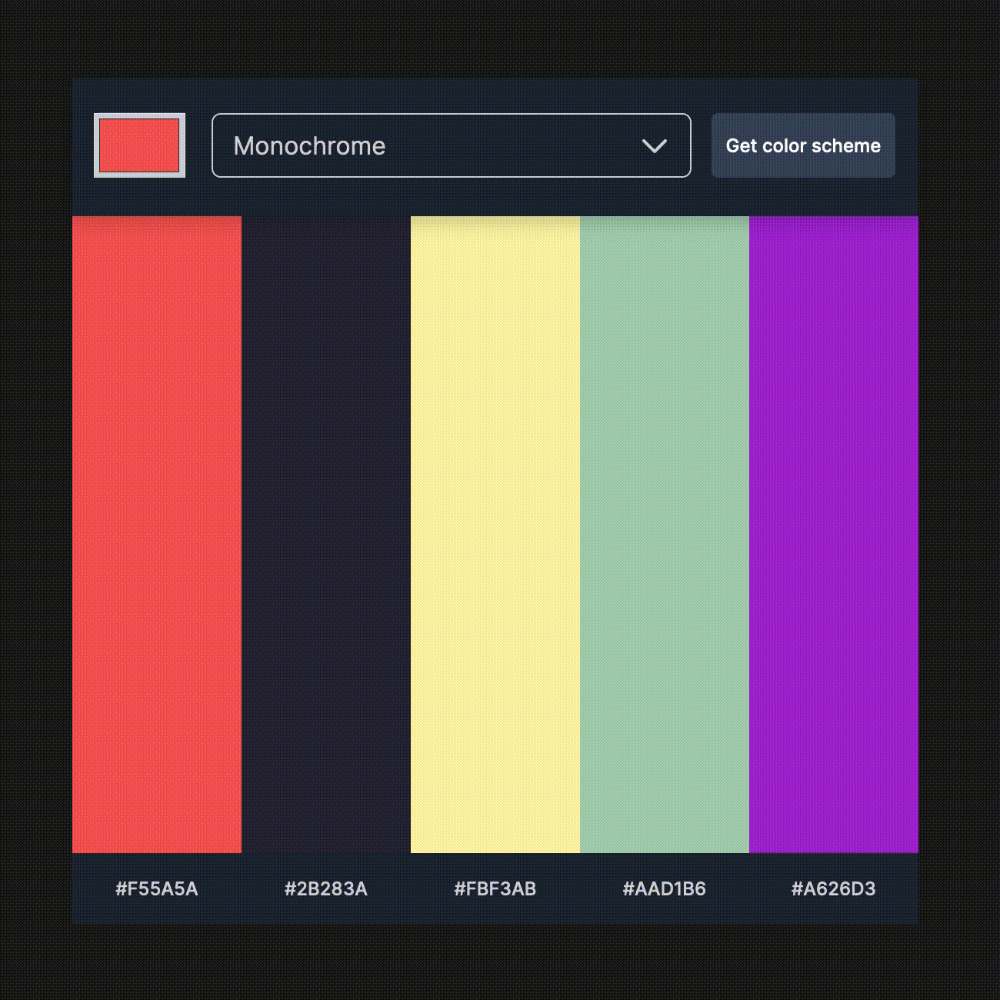

# Color Scheme Generator

This is the Color Scheme Generator project in the Scrimba Frontend Developer Career Path.

## Table of contents

-   [Overview](#overview)
    -   [The challenge](#the-challenge)
    -   [Requirements](#requirements)
    -   [Stretch Goals](#stretch-goals)
    -   [Screenshot](#screenshot)
    -   [Links](#links)
-   [My process](#my-process)
    -   [Built with](#built-with)
    -   [What I learned](#what-i-learned)
    -   [Continued development](#continued-development)
    -   [Useful resources](#useful-resources)
-   [Author](#author)

## Overview

### The challenge

The challenge was to create a Color Scheme Generator app using a Figma design. Users can choose a seed color and the generator mode, and the app will use an API to generate a suitable color scheme.

### Requirements

-   Choose "seed color" with an `<input type="color" />`
-   Choose color scheme mode in a `<select>` box
-   Clicking the button makes a request to [The Color API](https://www.thecolorapi.com/docs#schemes) to get a color scheme
-   Display the scheme colors and hex values on the page
-   Light and Dark themes

### Stretch Goals

-   Click colors (including the hex values) to copy to clipboard

### Screenshot

### Links

-   Solution URL: <https://github.com/gdsimoes/color-scheme-generator/>
-   Live Site URL: <https://gdsimoes.github.io/color-scheme-generator/>

## My process

### Built with

-   Figma
-   Sass (SCSS)
-   Shadow DOM Manipulation
-   ES6 Modules
-   Fetch
-   REST API

### What I learned

The primary purpose of this project was to get some experience with APIs using modern techniques like the fetch function. But getting the API to work was the easy part. It is very challenging to customize the color picker and drop-down menu, and getting consistent appearance and behavior across browsers was a nightmare. I had to delve into the Shadow DOM, something I didn't even know existed.

### Continued development

The original Figma design doesn't work with smaller screen sizes, so if I ever have the time, I want to return to this project and implement my mobile design.

### Useful resources

-   [W3 Schools - Custom Select Box](https://www.w3schools.com/howto/howto_custom_select.asp) - This article had everything I needed to learn how to create custom drop-down menus. Unfortunately, the code was highly convoluted, with an atrocious choice of variable names. I had to use all the skills of understanding poorly written code I acquired as a teacher.
-   [CSS Tricks - Color Inputs: A Deep Dive into Cross-Browser Differences](https://css-tricks.com/color-inputs-a-deep-dive-into-cross-browser-differences/) - This article was a lifesaver. I learned about the Shadow DOM, how to manipulate it, and how to set up both Firefox's and Chrome's developer tools to help me inspect it.
-   [Stack Overflow - Box-shadow over next sibling div](https://stackoverflow.com/questions/31276634/box-shadow-over-next-sibling-div) - CSS throws a curveball at us from time to time. My `box-shadow` property wasn't working correctly, and the answers here helped me solve this problem.

## Author

-   Website - <https://gdsimoes.com>
-   LinkedIn - [Guilherme Dias Simoes](https://www.linkedin.com/in/gdsimoes)
